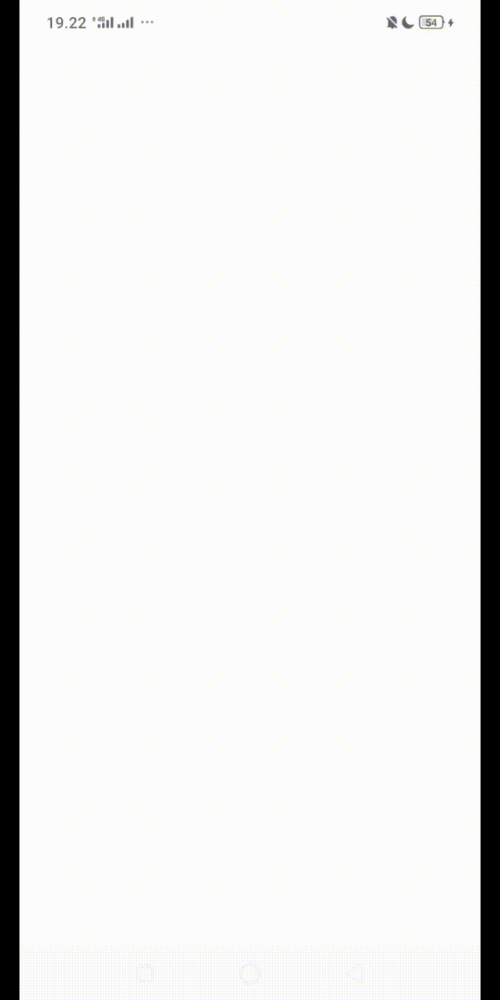

# HelloToast
COUNT button, when you press it a number will appear how many times you press it in the TextView. RESET button, to restart the calculation. Toast will appear when you press the TOAST button which displays information on the number of numbers due to the COUNT button. 

